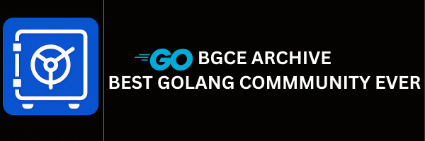

# 🌐 **Golang Community Vault**

  

Welcome to **Golang Community Vault**, a community-driven digital archive designed to collect, organize, and preserve the vast knowledge, resources, and experiences from the Go programming ecosystem and beyond. Whether you're a beginner, job seeker, seasoned contributor, or mentor — **this is the place** where we give and receive knowledge.

---

## 🎯 **Project Purpose**

The **Golang Community Vault** is not just an archive, it's a vibrant, evolving repository that serves:

- 📚 **Preservation** of valuable community-generated content.
- 🤝 **Collaboration** to promote open knowledge sharing and growth.
- 🔎 **Job Seekers & Learners** can gain insights from real-world experiences.
- 🧠 **Centralized Resources** to gather knowledge and tools scattered across the web.

---

## IMPORTANT: check out our book for detailed info: [ARCHIVE-DOCS](https://nesohq.github.io/bgce-archive/) <<<

## 💬 **Stay Connected & Grow With Us!**

We believe in **community-driven learning**. Whether you're here to contribute, collaborate, or just explore — your presence makes a difference. 💛

Join the **Best Golang Community Ever** and become part of something bigger than just code!

---

### 🌐 **Connect With Us**

| 🌟 Platform            | 📌 Join Link                                                                                                                                           |
| ---------------------- | ------------------------------------------------------------------------------------------------------------------------------------------------------ |
| 💬 **Discord**         | [Join the Go Community on Discord](https://discord.gg/xUVYrGaXS3) – Real-time discussions, questions, support, and collab rooms.                       |
| 📘 **Facebook Group**  | [Join the Go Facebook Community](https://www.facebook.com/groups/1118405403169990) – Casual Q&As, success stories, community posts, and announcements. |
| 🎥 **YouTube Channel** | [Subscribe to GoWithHabib](https://www.youtube.com/@gowithhabib) – Deep dives, tutorials, interviews, and community videos.                            |

---

### 🤝 **Get Involved**

✅ Share your stories, notes, code, or insights  
✅ Help with templates, docs, automation, or structure  
✅ Collaborate on our **static site** or **web vault**  
✅ Be part of building something that helps thousands

---

### ✨ **Together, We Learn & Grow**

> _“Code fades. Community lasts.”_  
> Let’s archive knowledge, share what we’ve learned, and help the next generation of Gophers grow. 🐹🚀

---

## ✨ Contributors

Thanks goes to these wonderful people:

<!-- ALL-CONTRIBUTORS-LIST:START - Do not remove or modify this section -->
<!-- prettier-ignore-start -->
<!-- markdownlint-disable -->
<table>
  <tbody>
    <tr>
      <td align="center" valign="top" width="14.28%"><a href="https://github.com/JsIqbal"> <b>Iqbal</b></a> <a href="https://github.com/NesoHQ/bgce-archive/commits?author=JsIqbal" title="Code">💻</a> <a href="https://github.com/NesoHQ/bgce-archive/commits?author=JsIqbal" title="Documentation">📖</a> <a href="#design-JsIqbal" title="Design">🎨</a> <a href="#infra-JsIqbal" title="Infrastructure (Hosting, Build-Tools, etc)">🚇</a> <a href="https://github.com/NesoHQ/bgce-archive/pulls?q=is%3Apr+reviewed-by%3AJsIqbal" title="Reviewed Pull Requests">👀</a> <a href="#maintenance-JsIqbal" title="Maintenance">🚧</a></td>
      <td align="center" valign="top" width="14.28%"><a href="https://github.com/nazma98"> <b>nazma98</b></a> <a href="https://github.com/NesoHQ/bgce-archive/commits?author=nazma98" title="Code">💻</a> <a href="https://github.com/NesoHQ/bgce-archive/pulls?q=is%3Apr+reviewed-by%3Anazma98" title="Reviewed Pull Requests">👀</a> <a href="#maintenance-nazma98" title="Maintenance">🚧</a></td>
      <td align="center" valign="top" width="14.28%"><a href="https://github.com/ifrunruhin12"> <b>ifrunruhin12</b></a> <a href="https://github.com/NesoHQ/bgce-archive/commits?author=ifrunruhin12" title="Code">💻</a> <a href="https://github.com/NesoHQ/bgce-archive/pulls?q=is%3Apr+reviewed-by%3Aifrunruhin12" title="Reviewed Pull Requests">👀</a> <a href="#maintenance-ifrunruhin12" title="Maintenance">🚧</a></td>
      <td align="center" valign="top" width="14.28%"><a href="https://github.com/mdimamhosen"> <b>mdimamhosen</b></a> <a href="https://github.com/NesoHQ/bgce-archive/commits?author=mdimamhosen" title="Code">💻</a></td>
      <td align="center" valign="top" width="14.28%"><a href="https://github.com/shahriar-em0n"> <b>shahriar-em0n</b></a> <a href="https://github.com/NesoHQ/bgce-archive/commits?author=shahriar-em0n" title="Code">💻</a></td>
      <td align="center" valign="top" width="14.28%"><a href="https://github.com/0xRokib"> <b>0xRokib</b></a> <a href="https://github.com/NesoHQ/bgce-archive/commits?author=0xRokib" title="Code">💻</a></td>
      <td align="center" valign="top" width="14.28%"><a href="https://github.com/MehediMubin"> <b>MehediMubin</b></a> <a href="https://github.com/NesoHQ/bgce-archive/commits?author=MehediMubin" title="Code">💻</a></td>
    </tr>
    <tr>
      <td align="center" valign="top" width="14.28%"><a href="https://github.com/TanvirTian"> <b>TanvirTian</b></a> <a href="https://github.com/NesoHQ/bgce-archive/commits?author=TanvirTian" title="Code">💻</a></td>
      <td align="center" valign="top" width="14.28%"><a href="https://github.com/0baydullah"> <b>0baydullah</b></a> <a href="https://github.com/NesoHQ/bgce-archive/commits?author=0baydullah" title="Code">💻</a></td>
      <td align="center" valign="top" width="14.28%"><a href="https://github.com/dynamiclance"> <b>dynamiclance</b></a> <a href="https://github.com/NesoHQ/bgce-archive/commits?author=dynamiclance" title="Code">💻</a></td>
      <td align="center" valign="top" width="14.28%"><a href="https://github.com/fardinabir"> <b>fardinabir</b></a> <a href="https://github.com/NesoHQ/bgce-archive/commits?author=fardinabir" title="Code">💻</a></td>
      <td align="center" valign="top" width="14.28%"><a href="https://github.com/rahim-jr"> <b>rahim-jr</b></a> <a href="https://github.com/NesoHQ/bgce-archive/commits?author=rahim-jr" title="Code">💻</a></td>
      <td align="center" valign="top" width="14.28%"><a href="https://github.com/hazratali-uydevelopers"> <b>hazratali-uydevelopers</b></a> <a href="https://github.com/NesoHQ/bgce-archive/commits?author=hazratali-uydevelopers" title="Code">💻</a></td>
      <td align="center" valign="top" width="14.28%"><a href="https://github.com/lowercase-tousif"> <b>lowercase-tousif</b></a> <a href="https://github.com/NesoHQ/bgce-archive/commits?author=lowercase-tousif" title="Code">💻</a></td>
    </tr>
    <tr>
      <td align="center" valign="top" width="14.28%"><a href="https://github.com/mahabubulhasibshawon"> <b>mahabubulhasibshawon</b></a> <a href="https://github.com/NesoHQ/bgce-archive/commits?author=mahabubulhasibshawon" title="Documentation">📖</a></td>
    </tr>
  </tbody>
</table>

<!-- markdownlint-restore -->
<!-- prettier-ignore-end -->

<!-- ALL-CONTRIBUTORS-LIST:END -->

This project follows the [all-contributors](https://github.com/all-contributors/all-contributors) specification.
Contributions of any kind welcome! 🚀
